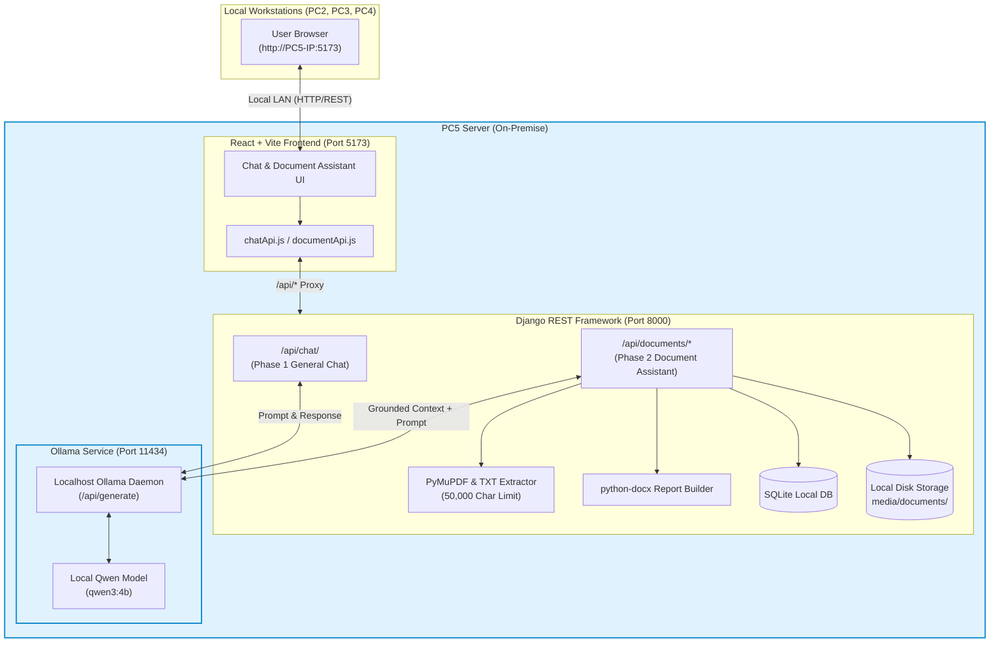

# MRPL AI Workbench (Phase 1 & Phase 2)

An on-premise, privacy-compliant AI Chat and Document Assistant designed for internal corporate deployment (PC5 server) with access from local workstations (PC2, PC3, PC4) over the local LAN.

---

## 1. System Architecture Overview



### High-Level Network Flow
```text
[PC2 / PC3 / PC4 Browser]
        │
    (Local LAN)
        │
        ▼
[PC5: React + Vite Frontend] (http://<PC5-IP>:5173)
        │
        ▼ (HTTP REST API: /api/*)
[PC5: Django REST API] (http://<PC5-IP>:8000)
        │
        ├── Phase 1: POST /api/chat/ ────────────────────────────┐
        │                                                        ▼
        ├── Phase 2: POST /api/documents/upload/ ──> PyMuPDF ──> Ollama Server (http://127.0.0.1:11434)
        │            POST /api/documents/<id>/ask/ ──────────────┤
        │            POST /api/documents/<id>/summary/ ──────────┤
        │            POST /api/documents/<id>/generate-report/   ▼
        │                                                  [Local Qwen Model (qwen3:4b)]
        ▼
[Local PC5 Storage: SQLite DB & media/documents/]
```

---

## 2. Privacy & Security Architecture

- **Strictly On-Premise Execution**: All inference and text processing execute entirely within the local PC5 server.
- **Zero External API Calls**: Configured with `ALLOW_EXTERNAL_AI=False` to prevent requests to OpenAI, Gemini, Claude, or any third-party cloud service.
- **Ollama Bound to Localhost**: The Ollama API is restricted to `http://127.0.0.1:11434`, ensuring it is not directly exposed across the LAN.
- **On-Premise UI Indicators**: The application header displays:
  - `Deployment: On-Premise`
  - `External API: Disabled`
  - `Model: Local Ollama (Qwen)`
- **Offline Capable**: The application can run entirely without an active internet connection once initial dependencies and models are loaded.

---

## 3. Technology Stack

| Layer | Technology | Purpose |
|---|---|---|
| **Frontend** | React 18 + Vite | Modern, responsive SPA with fast build and HMR |
| **Icons & UI** | Lucide React | Clean, lightweight UI icons |
| **Backend** | Django 6 + Django REST Framework | Robust API engine, validation, and request routing |
| **CORS / LAN** | django-cors-headers | Multi-origin access for PC2, PC3, PC4 over LAN |
| **AI Inference** | Ollama | Local model management and HTTP generation service |
| **LLM Model** | Qwen 3 (4B) / Qwen 2.5 | Fast, high-quality local language model |
| **PDF Extraction** | PyMuPDF (`fitz`) | Fast, accurate PDF text extraction |
| **Document Reports**| `python-docx` | Dynamic Word (.docx) report generation |
| **Database** | SQLite | Lightweight local metadata persistence |
| **Environment** | `env/` (Python venv) | Fully isolated dependency environment |

---

## 4. End-to-End Processing Flows

### Phase 1: General Chat Flow
```text
User Input (Browser)
       │
       ▼
POST /api/chat/ (ChatSerializer validates 'message')
       │
       ▼
ask_ollama() (chat/services.py)
       │
       ▼
HTTP POST http://127.0.0.1:11434/api/generate (Ollama on PC5)
       │
       ▼
Local Qwen Model generates response
       │
       ▼
JSON Response -> React UI -> Message Bubble displayed
```

### Phase 2: Document Processing & Q&A Flow
```text
1. Upload & Extraction:
   User uploads PDF/TXT ──> POST /api/documents/upload/
                              ├── Validate file type (.pdf or .txt only)
                              ├── Extract text (PyMuPDF for PDF, native for TXT)
                              ├── Cap extracted text to 50,000 characters
                              ├── Store file in media/documents/
                              └── Save metadata & extracted text in SQLite

2. Document Q&A:
   User asks question ────> POST /api/documents/<id>/ask/
                              ├── Retrieve extracted text for document
                              ├── Build grounded context prompt
                              ├── Query local Ollama (/api/generate)
                              └── Return answer to frontend Q&A box

3. Executive Summary:
   User clicks Summary ───> POST /api/documents/<id>/summary/
                              ├── Build structured summarization prompt
                              ├── Query local Ollama
                              └── Return structured overview, key points & conclusions

4. Word Report Generation:
   User clicks Export ────> POST /api/documents/<id>/generate-report/
                              ├── Compile metadata table
                              ├── Format AI summary & extracted content preview
                              └── Stream downloadable .docx file
```

---

## 5. Repository Structure

```text
mrpl-ai-workbench/
├── backend/
│   ├── manage.py                   # Django CLI utility
│   ├── config/
│   │   ├── settings.py             # DRF, CORS, Ollama, LAN, Media configuration
│   │   ├── urls.py                 # Root URL routing
│   │   ├── asgi.py                 # ASGI entrypoint
│   │   └── wsgi.py                 # WSGI entrypoint
│   ├── chat/                       # Phase 1: General Chat App
│   │   ├── apps.py
│   │   ├── serializers.py          # Validates 'message'
│   │   ├── services.py             # ask_ollama(message)
│   │   ├── views.py                # ChatAPIView (POST /api/chat/)
│   │   ├── urls.py
│   │   └── tests.py                # Chat automated unit tests
│   └── documents/                  # Phase 2: Document Assistant App
│       ├── apps.py
│       ├── models.py               # Document model with disk cleanup
│       ├── extractors.py           # PyMuPDF & TXT text extraction (50k limit)
│       ├── services.py             # Document Q&A and summary services
│       ├── generators.py           # python-docx report generation
│       ├── serializers.py          # List, Detail, Upload, Ask, Report serializers
│       ├── views.py                # Endpoints for upload, list, ask, summary, docx
│       ├── urls.py
│       └── tests.py                # Document automated unit tests
├── frontend/
│   ├── package.json
│   ├── vite.config.js              # 0.0.0.0 host binding & /api backend proxy
│   ├── index.html
│   └── src/
│       ├── main.jsx
│       ├── App.jsx                 # Top-level state & Tab switcher (Chat / Documents)
│       ├── App.css                 # Comprehensive responsive styling
│       ├── index.css               # Design tokens & base CSS
│       ├── api/
│       │   ├── chatApi.js          # Client for Phase 1 chat endpoint
│       │   └── documentApi.js      # Client for Phase 2 document endpoints
│       └── components/
│           ├── Header.jsx          # Header with navigation tabs & privacy badges
│           ├── ChatWindow.jsx      # Phase 1 Chat message stream & empty state
│           ├── MessageBubble.jsx   # Message bubble with copy response feature
│           ├── MessageInput.jsx    # Textarea with Enter-to-send
│           └── documents/
│               ├── DocumentUpload.jsx      # Drag & drop upload card
│               ├── DocumentList.jsx        # Document selection list
│               ├── DocumentViewer.jsx      # Workspace (Q&A, Summary, Raw text tabs)
│               ├── DocumentQuestionBox.jsx # Document-specific Q&A chat
│               └── DocumentsPage.jsx       # Document Assistant master-detail layout
├── .env.example                    # Template for environment variables
├── .gitignore                      # Ignores env/, db.sqlite3, media/, node_modules/
├── requirements.txt                # Frozen Python dependencies
└── README.md                       # Documentation & Architecture guide
```

---

## 6. API Endpoints Reference

### Chat Endpoints (Phase 1)
| Method | Endpoint | Description | Payload |
|---|---|---|---|
| `POST` | `/api/chat/` | Send a prompt to the local AI model | `{"message": "Hello"}` |

### Document Endpoints (Phase 2)
| Method | Endpoint | Description | Payload |
|---|---|---|---|
| `POST` | `/api/documents/upload/` | Upload and extract a PDF or TXT file | `multipart/form-data` with `file` |
| `GET` | `/api/documents/` | List all uploaded documents | None |
| `GET` | `/api/documents/<id>/` | Get details and extracted text of a document | None |
| `POST` | `/api/documents/<id>/ask/` | Ask a question grounded in the document | `{"question": "..."}` |
| `POST` | `/api/documents/<id>/summary/` | Generate an executive summary of the document | None |
| `POST` | `/api/documents/<id>/generate-report/` | Download a Word (.docx) report | `{"summary": "..."}` (optional) |
| `DELETE` | `/api/documents/<id>/` | Delete document record and physical file | None |

---

## 7. Quickstart Guide

### Step 1: Ensure Ollama is Running on PC5
```bash
ollama serve
# Ensure your model is installed:
ollama pull qwen3:4b
```

### Step 2: Start Django Backend (Terminal 1)
```bash
cd /home/onish/Desktop/Dj
./env/bin/python backend/manage.py runserver 0.0.0.0:8000
```

### Step 3: Start React Frontend (Terminal 2)
```bash
cd /home/onish/Desktop/Dj/frontend
npm run dev -- --host 0.0.0.0
```

### Step 4: Access the Application
- **Locally on PC5**: `http://localhost:5173`
- **Across Local LAN (PC2, PC3, PC4)**: `http://192.168.1.11:5173` *(find your PC5 IP using `hostname -I`)*.

---

## 8. Automated Testing

The repository includes a comprehensive automated test suite testing both Phase 1 and Phase 2:

```bash
cd /home/onish/Desktop/Dj
./env/bin/python backend/manage.py test documents chat --verbosity=2
```

### Test Coverage (18 Tests Total):
- **Document Tests (`documents.tests`)**:
  - `test_upload_valid_pdf_file`: PyMuPDF text extraction from PDF.
  - `test_upload_valid_txt_file`: Text extraction from `.txt`.
  - `test_reject_unsupported_extensions`: Rejection of `.docx`, `.xlsx`, `.jpg`, `.png`.
  - `test_reject_empty_file`: Rejection of empty files with HTTP 400.
  - `test_character_limit_truncation`: Enforces strict 50,000-character cap.
  - `test_ask_question_about_document`: Document Q&A with mocked Ollama response.
  - `test_summarize_document`: Executive summary generation with mocked Ollama.
  - `test_generate_and_download_docx_report`: Word document generation and binary verification.
  - `test_delete_document`: Database record and disk file cleanup.
  - `test_ollama_offline_returns_503`: Graceful HTTP 503 fallback when Ollama is unavailable.
  - `test_phase1_chat_still_works`: Regression verification for Phase 1.
- **Chat Tests (`chat.tests`)**:
  - `test_valid_message_success`: Valid chat prompt with mocked response.
  - `test_empty_message`: Empty prompt validation (HTTP 400).
  - `test_missing_message_field`: Missing field validation (HTTP 400).
  - `test_ollama_server_connection_error`: Ollama offline handling (HTTP 503).
  - `test_ollama_server_timeout`: Request timeout handling (HTTP 503).
  - `test_ollama_server_http_error`: Upstream 500 error handling (HTTP 503).
  - `test_ask_ollama_service_direct`: Unit test for direct service invocation.